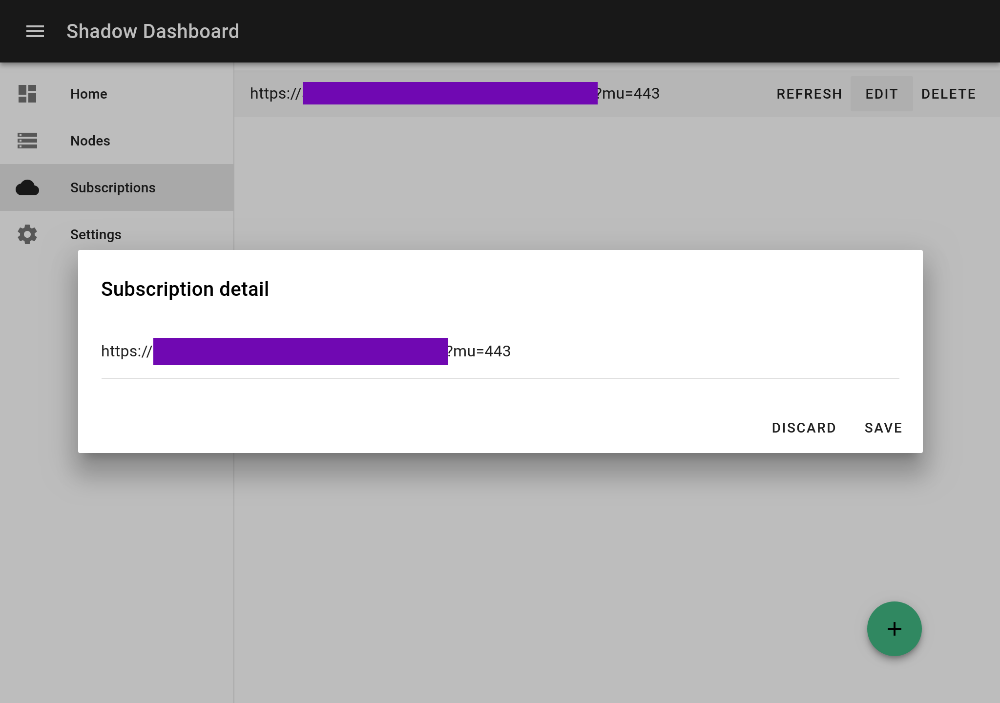
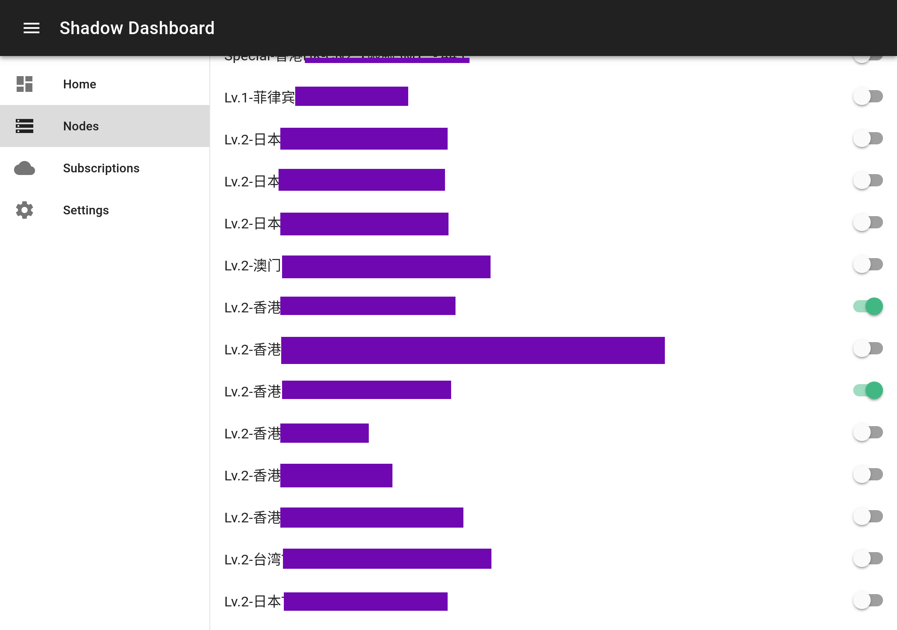
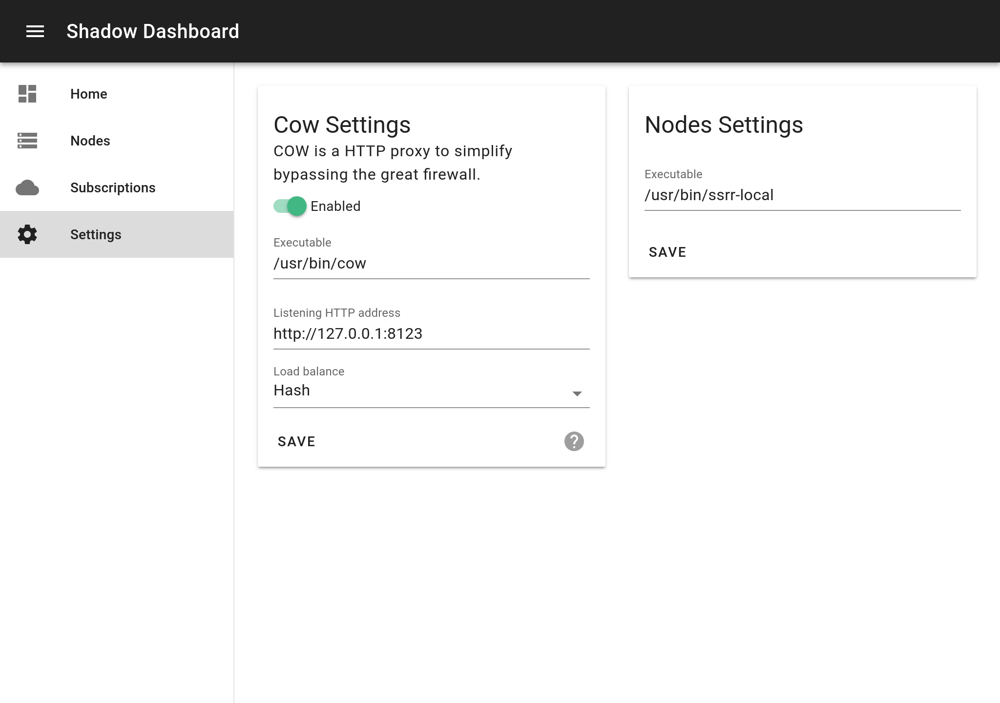

# Shadow Dashboard

[中文README](https://github.com/perqin/shadow-dashboard/blob/master/README.zh.md)

Local Shadowsocks and ShadowsocksR dashboard for multiple clients on Linux.

**This project is still under early development.**

## Features

* Manage ShadowsocksR subscriptions.

   

* Enable multiple nodes. Enable any node on one click. Listening port is allocated automatically.

   

* Load balancing, smart blocked sites detection and HTTP-to-SOCKS5 proxy with the power of [cow](https://github.com/cyfdecyf/cow).

   

## Installation

### Requirements

* Only Linux is supported.
* Git.
* Node.js 7.6 or later.
* NPM or Yarn.
* [cow](https://github.com/cyfdecyf/cow).
* shadowsocksr-libev or its forks (e.g. [shadowsocksrr-libev](https://github.com/shadowsocksrr/shadowsocksr-libev)).

### Install guide

1. Clone this repository:

   ```shell
   git clone https://github.com/perqin/shadow-dashboard.git
   cd shadow-dashboard
   ```

2. Install dependencies:

   ```shell
   # With NPM
   npm install
   # With Yarn
   yarn install
   ```

3. Start the backend:

   ```shell
   node ./src/bin/server.js
   ```

   Optionally, if you have installed PM2 globally, you can use `startup/ecosystem.config.js` to start Shadow Dashboard on boot.

4. Open `http://localhost:4566` in browser for management. **Remember to configure cow binary path and shadowsocksr-local binary path in Settings page before starting any nodes!**

### Upgrade

To upgrade Shadow Dashboard, pull latest commits via Git and then restart Shadow Dashboard.