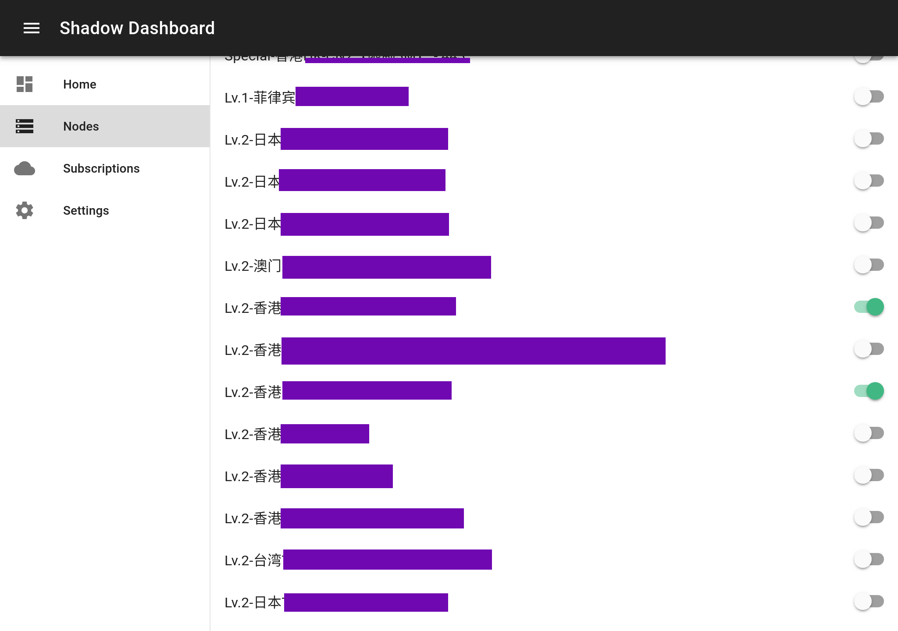

# Shadow Dashboard

[English README](https://github.com/perqin/shadow-dashboard/blob/master/README.md)

为 Linux 用户开发的多客户端本地 Shadowsocks 与 ShadowsocksR 管理面板。

**该项目仍在早期开发阶段。**

## 特性

* 管理 ShadowsocksR 订阅。

   

* 启用多个节点。轻击一下即可启用任一节点，自动分配本地监听端口号。

   

* 借由 [cow](https://github.com/cyfdecyf/cow) 的强大功能，支持负载均衡、智能检测被屏蔽网站和提供 HTTP-to-SOCKS5 代理。

   

## 安装

### 前提

* 仅支持 Linux 操作系统。
* Git。
* Node.js 7.6 或更新版本。
* NPM 或 Yarn。
* [cow](https://github.com/cyfdecyf/cow)。
* shadowsocksr-libev 或其分支 (如 [shadowsocksrr-libev](https://github.com/shadowsocksrr/shadowsocksr-libev))。

### 安装指南

1. 克隆本仓库：

   ```shell
   git clone https://github.com/perqin/shadow-dashboard.git
   cd shadow-dashboard
   ```

2. 安装依赖：

   ```shell
   # 若使用 NPM
   npm install
   # 若使用 Yarn
   yarn install
   ```

3. 启动后台：

   ```shell
   node ./src/bin/server.js
   ```

   作为可选方案，如果你安装了全局的 PM2，那么可以使用 `startup/ecosystem.config.js` 文件用于开机自启动。

4. 在浏览器打开 `http://localhost:4566` 以开始管理。 **在开始启用任何节点之前，请务必先进入设置页面配置好 cow 和 shadowsocksr-local 的二进制可执行文件路径！**

### 升级

要升级 Shadow Dashboard，直接通过 Git 拉取最新提交，然后重启 Shadow Dashboard。